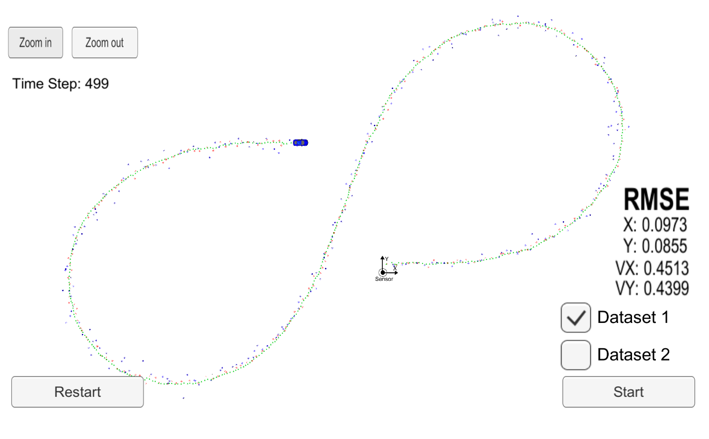

# Extended Calman Filter (EKF) Implementation

## Project Intro

This project implements EKF in C++.  EKF is used to track an object position based on lidar and radar measurements.
The algorith first predicts the object position based on a simple motion model and calculates covariance matrix
(position uncertainty).   Then, it uses the incoming measurements to update the position.  If position uncertainty is larger
then measurement uncertainty,  the measurement's update is given more weight and vice versa.
"Fusing" the sensor measurements produces a better result than if only one sensor were used.

## Running Project 
Please refer to the original Udacity project [README](./README_orig.md)

## Project Output

The blue dots are radar measurements, the red dots are laser measurements, and the green dots are the EKF tracking results.
The positions of green dots are sent from [main.cpp](./main.cpp) to the simulator.

Over the run of the simulation, Root Mean Square Error (RMSE) is calculated for the position and the velocity predictions.  The ground
truth values for the calculation are supplied by the simulator.  The estimations are accumulated, such that each RMSE value is 
cumulative at each moment.  The simulator displays RMSE in the lower corner.
